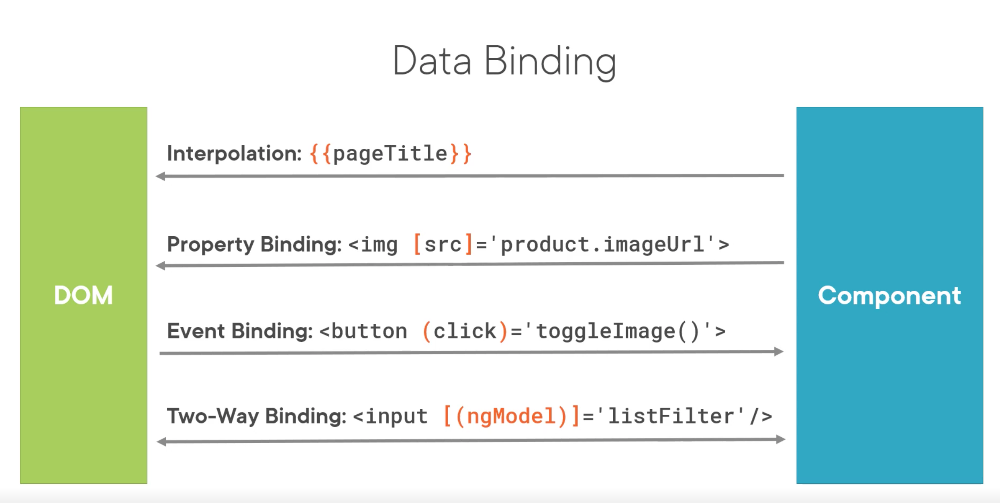

# **Data Binding and Pipes**

# Property Binding

```html

<input type='text' [disabled]='isDisabled'/>
```

- [src] = Element Property surrounded by brackets

- 'product.imageUrl' = Template Expression surrounded by single quotes

- As opposed to interpolation where the element property does not have brackets and template expression is surrounded by curly braces

- ```html
  
   //may be preferred
  ```

# Event Binding

Allows to combine an event with a method.

https://developer.mozilla.org/en-US/docs/Web/Events

```html
<button (click)='toggleImage()'>
```

# Change Detection

```html
<button class='btn btn-primary'
				(click)='toggleImage()'>
	{{showImage ? 'Hide' : 'Show'}} Image
</button>
```

```typescript
export class ProductListComponent {
	showImage = false;
	
	toggleImage(): void {
	this.showImage = !this.showImage;
	}
}
```

```html

```

# Two-way Binding

Input element is displayed in the template.

```html
<div class='col-md-2'>Filter by:</div>
<div class='col-md-4'>
	<input type='text' [(ngModel)]='listFilter'/> // Custom HTML syntax
</div>
```

```typescript
export class ListComponent {
	listFilter: string = 'cart';
}
```

ngModel needs the FormsModule added in the app module for it to work.

# Transforming Data with Pipes

- Transform bound properties before display

- Built-in pipes: date, number, decimal, percent, currency, json, etc.

- Custom pipes

  ```html
  {{product.productCode | lowercase}}
  
  
  
  {{product.price | currency | lowercase}} //more than one property
  
  {{product.price | currency: 'USD':'symbol':'1.2-2'}} //parameters
  ```

  - Pipe character |
  - Pipe name
  - Pipe parameters separated with colons



# Building a Custom Pipe

- Create a class that implements PipeTransform
- Write code for the Transform method
- Decorate the class with the Pipe decorator
- Add the pipe to the declarations array of an Angular module
- Use the pipe in a template
  - Pipe character
  - Pipe name
  - Pipe arguments (separated with colons)

```typescript
import { Pipe, PipeTransform } from '@angular/core';

@Pipe({
	name: 'convertToSpaces'
})
export class ConvertToSpacesPipe implements PipeTransform {
	transform(value: string,
						character: string): string {			
	}
}
```

```html
<td>{{ product.productCode | convertToSpaces:'-'}}</td>
```

# Getters and Setters

```typescript
private _amount: number = 0;
get amount(): number {
  // process the amount
  // return amount from private storage
  return this._amount;
}
set amount(value: number) {
  // process the amount
  // retain amount in private storage
  this._amount = value;
}

this.amount = 200;
console.log(this.amount);
```

# Filtering a List

```typescript
products: IProduct[] = [...];

performFilter(): IProduct[] {
	return this.products.filter((product: IProduct) => product.productName.includes(this.listFilter));
}
```

# Arrow Functions

An arrow function is compact syntax for defining a function.

```typescript
// Classic named function (method)
capitalizeName(product: IProduct): string {
	return product.productName.toUpperCase();
}

// Arrow function
(product: IProduct) => product.productName.toUpperCase();

// Multi-statement arrow function
(product: IProduct) => {
  console.log(product.productName);
  return product.productName.toUpperCase();
}
```

