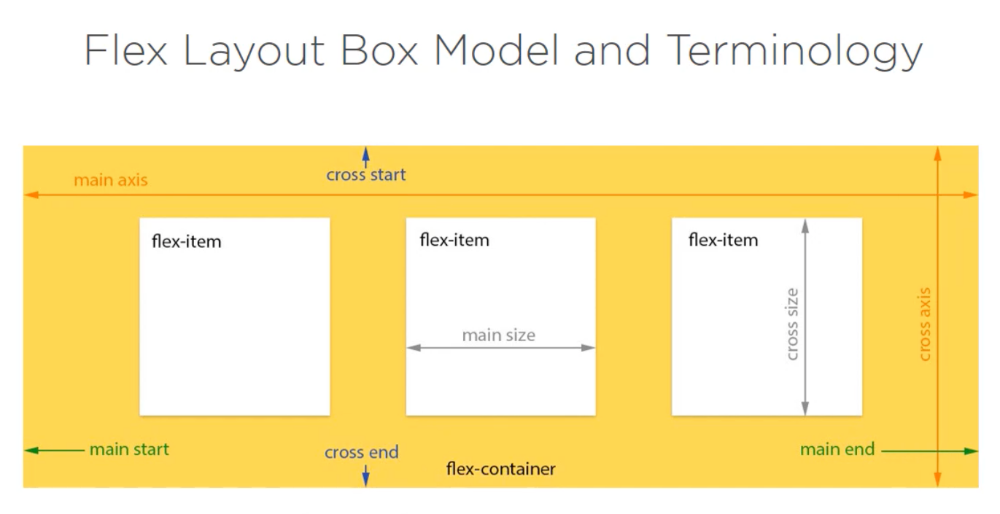

[TOC]

# References

- Material Design Specification - https://material.io/
- Angular Material
  - https://material.angular.io/
  - https://github.com/angular/components
- Material Icons Guide - https://google.github.io/material-design-icons/
- Angular Flex Layout Demo - https://tburleson-layouts-demos.firebaseapp.com

# Principles

- Material is the metaphor
- Bold, graphic and intentional
- Motion provides meaning

# Install

```
ng add @angular/material
```

- Angular Material
- Component Dev Kit (CDK)
- Angular Animations

# Flex Layout

Install Flex Layout

```
npm i -s @angular/flex-layout + @angular/flex-layout@12.0.0-beta.34
```



