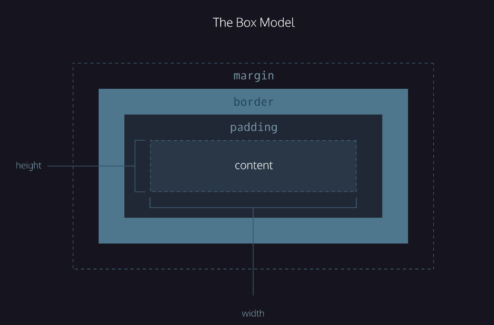

# CSS

[Cascading Style Sheets](https://developer.mozilla.org/en-US/docs/Web/CSS) for describing how elements should look on screen.

[Tips and Tricks](CSS/tips.md)


`.class`- when appending using a class, a period must be appended to the class's name.

`#id`- when appending using an id, a hashtag must be appended to the id's name.

## [HTML Attributes](https://developer.mozilla.org/en-US/docs/Web/HTML/Attributes)

`[href]`- when targetting an attribute, the attribute needs to be surrounded by square brackets.

`type[attribute*=value]` - selects an element where the attribute contains any instance of the specified value.

`p:hover`- pseudo-class selectors such as `:focus`, `:visited`, `:disabled`, and `:active` give elements a different state.

## Chaining

`h1.special`- combining multiple selectors, so this would select only the `<h1>` elements with a class of `special`.

## Descendents

`.main-list li`- nested elements are descendents of the `<ul>` element and can be selected with the *descendent combinator*, so this would select the `.main-lis` class (the `<ul>` element) and then adding `li` separated by a space.

## Multiple Selectors

It's possible to add CSS styles to multiple CSS selectors all at once. This prevents writing repetitive code.

```css
h1 {
	font-family: Georgia;
}

.menu {
	font-family: Georgia;
}

/* Combine the selectors, separated by commas */
h1,
.menu {
  font-family-Georgia;
}
```

## Visual Rules

`font-family`: changes the typeface of text

`font-size`: changes the size of the text

`font-weight`: controls how bold or thin text appears

`text-align`: change where the text appears

- `left`: aligns to the left side of its parent element
- `center`: centers text inside of its parent element
- `right`: aligns text to the right side of the parent element
- `justify`: spaces out text in order to align with the right and left side of the parent element

`color`: styles an element's foreground color

`background-color`: styles an element's background color

`opacity`: measures how transparent an element is, from 0 to 1, with 1 representing 100% opaque (fully visible), and 0 representing 0% or fully invisible

`background-image`: change the background of an element which includes `url('url.jpg');`

`!important`: can be applied to specific declarations instead of full rules and will override any style no matter how specific `color: blue !important;`

## Box Model

The box modeal comprises the set of properties that define parts of an element that take up space on a web page. The model includes the content area's size (*width* and *height*) and the element's *padding*, *border*, and *margin*.



- `width` and `height`: the width and height of the content area
  - `min-width`, `max-width`, `min-height` and `max-height` to setting limits to width and height
- `padding`: the amount of space between the content area and the border, and can be used specifically with `padding-top`, `padding-bottom`, `padding-left` and `padding-right`
  - 4 Values: top, right, bottom, left
  - 3 Values: top, left and right, bottom
  - 2 Values: top and bottom, left and right
- `border`: the thickness and style of the border surrounding the content area and padding, using width, [style](https://developer.mozilla.org/en-US/docs/Web/CSS/border-style#values) and [color](https://developer.mozilla.org/en-US/docs/Web/CSS/color_value) `border: 3px solid coral;`
- `border-radius`: modify the corners of an element's border box; to make a circle first create element with the same height and width, then set the radius to half the width (50%)
- `margin`: the amount of space between the border and the outside edge of the element; specificity and values work the same as *padding*
  - `margin: 0 auto` will center in the assigned element (top and bottom are 0, left and right centers)
- `overflow`: controls what happens to content that spills outside its box
  - `hidden`: any content that overflows will be hidden from view
  - `scroll`: a scrollbar will be added to the element's box
  - `visible`: the overflow content will be displayed outside of the containing element (default value)
- `visibility`: hide elements
  - `hidden`: hides an element
  - `visible`: displays an element
  - `collapse`: collapses an element
- `box-sizing`: `border-box` resets the entire box model and is not affected by border thickness or padding (default is `content-box`)
