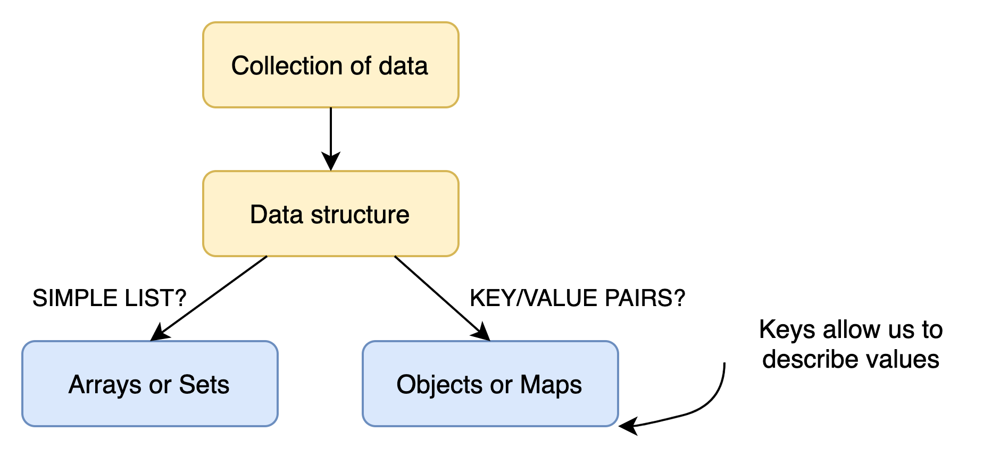
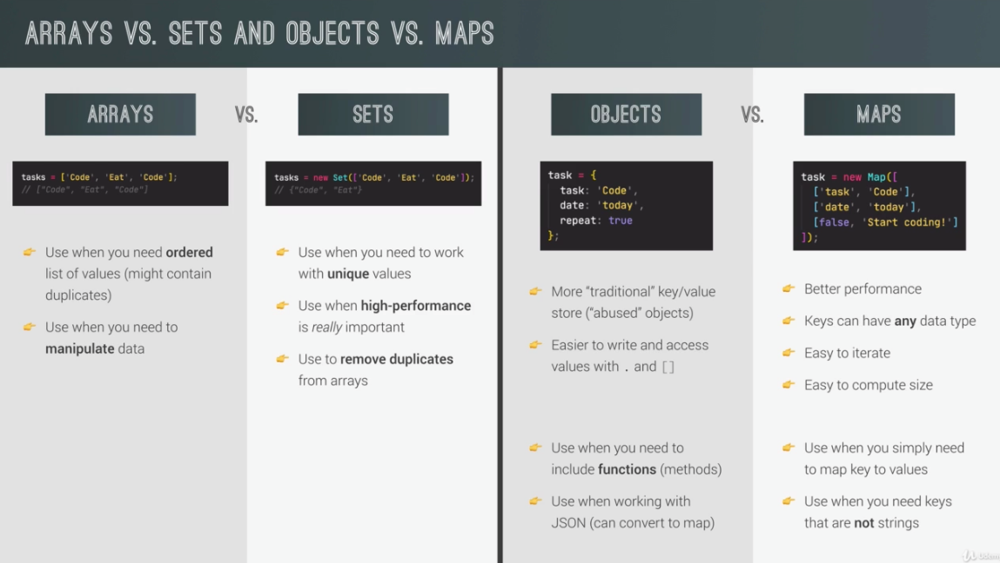

[TOC]

# Sources of Data

1. From the program itself: Data written directly in source code (e.g. status messages)
2. From the UI: Data input from the the user or data written in DOM (e.g. tasks in todo app)
3. From external sources: Data fetched for example from web API (e.g. recipe objects in JSON)





# Short-Circuiting

- || - When the first value is truthy, it will immediately return it. If not it will return the second value
- && - If the first value is false, then the entire statement is false. If the first value is true, but any other values are false, it will be false and the first false will be returned.
- ?? - Only nullish values will short circuit

# Destructuring

Destructuring arrays – assign to an array structure the actual array using brackets

```javascript
const arr = [2, 3, 4];

const [x, y, z] = arr;
console.log(x, y, z); result= 2 3 4

// Nested destructuring
const nested = [2, 4, [5, 6]];
const [i, , [j, k]] = nested;
console.log(i, j, k); result= 2 5 6

 // Default values
const [p = 1, q = 1, r = 1] = [8];
console.log(p, q, r); result= 8 1 1
```

Destructuring objects – Similar to destructuring arrays only with curly braces and using the properties

```javascript
const { name, openingHours, categories } = restaurant;
console.log(name, openingHours, categories);
```

To give each property a different name:

```javascript
const {
  name: restaurantName,
  openingHours: hours,
  categories: tags,
} = restaurant;
console.log(restaurantName, hours, tags);

// Nested objects
const {
  fri: { open: o, close: c },
} = openingHours;
console.log(o, c);
```

# Spread/Rest Operators and Iterables

Spread operator – allows you to add array items to an existing array without needing to itemize the original list. It's only used in cases where there are values separated by commas, such as an array, and doesn't assign variables to them.

```javascript
const arr = [7, 8, 9];
const newArr = [1, 2, ...arr];
console.log(newArr); result=(5) [1, 2, 7, 8, 9]
```

Listing the array items individually:

```javascript
console.log(...newArr); result= 1 2 7 8 9

// Copy array
const mainMenuCopy = [...restaurant.mainMenu];

// Join 2+ arrays
const menu = [...restaurant.mainMenu, ...restaurant.starterMenu];
```

Iterables: arrays, strings, maps, sets, but NOT objects

```javascript
const str = 'Jeanine';
const letters = [...str, ' ', 'S.'];
console.log(letters); result= (9) ["J", "e", "a", "n", "i", "n", "e"]
```

As of 2018, spreader can now be done with objects

```javascript
const newRestaurant = { foundedIn: 1998, ...restaurant, founder: 'Guiseppe' };
console.log(newRestaurant);

const restaurantCopy = { ...restaurant };
restaurantCopy.name = 'Ristorante Roma';
console.log(restaurantCopy.name, restaurant.name);
```

## Spread Operator vs Rest Operator

The main difference:

- The rest operator is used in places where we would otherwise write variable names separated by commas. This is because the rest operator collects elements (variable names) into an array or object – both of which are composed of elements (variable names) separated by commas. Thus, they can be used in places where arrays or objects can be used, such as…
  - Function parameters (when declaring/ expressing a function)
  - Left side of a destructuring assignment ( to collect individual elements into an object or an array which will be used to deconstruct the object or array on the right side of the assignment operator.
- The spread operator is used in places where we would otherwise write values separated by commas. This is because the spread operator spreads elements into individual values. Thus, they can be used in places where individual elements can be used, such as…
  - Function arguments (when calling a function)
  - In an array or object, on the right side of a destructuring assignment (to be assigned to the variables on the left side of the assignment operator).

# Optional Chaining (?.)

Checks to see if it's a valid object key and if not returns undefined rather than an error

```javascript
if (restaurant.openingHours.mon) console.log(restaurant.openingHours.mon.open);

 // WITH optional chaining
console.log(restaurant.openingHours?.mon?.open);

for (const day of weekdays) {
  const open = restaurant.openingHours[day]?.open ?? 'not open';
  console.log(`On ${day}, we open at ${open}`);
}
 
// Methods
console.log(restaurant.orderRisotto?.(0, 1) ?? 'Method does not exist');
 
// Array
const users = [{ name: 'Jeanine', email: 'jeanine@me.com' }];

console.log(users[0]?.name ?? 'User array empty');
```

