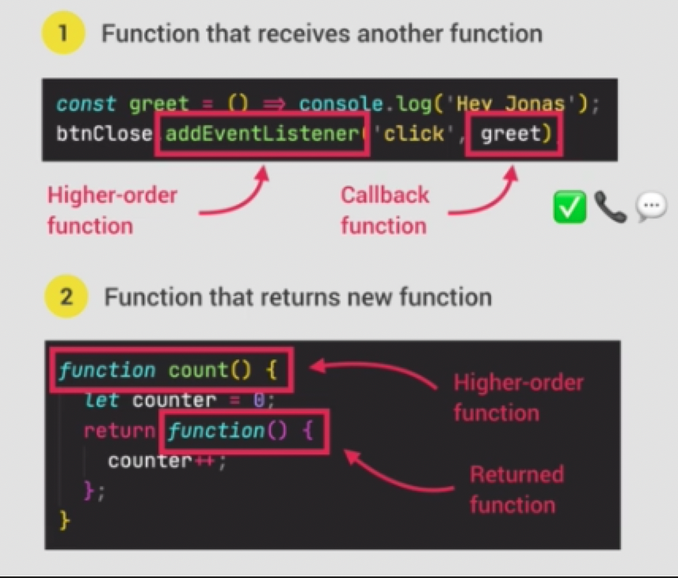
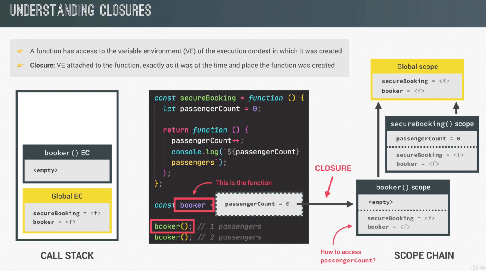

# **Functions**

JavaScript does not pass in references, only values. Even for non-primitive types that appear to pass in a reference, it's still a value but it's the memory reference value. Functions ARE values and objects.

# First-Class vs. Higher-Order

## First-Class Functions

- JavaScript treats functions     as **first-class citizens**
- This means that functions are     **simple     values**
- Functions are just another **"type"     of object**
- Store functions in variables     or properties
- Pass functions as arguments     to OTHER functions
- Return functions FROM     functions
- Call methods on functions

## Higher-Order Functions

- A function that receives another function as an argument, that returns a new function, or both
- This is only possible because of first-class functions



# Closures

https://developer.mozilla.org/en-US/docs/Web/JavaScript/Closures 

- A closure is the closed-over variable environment of the execution context in which a function was created, even after that execution is gone
- A closure gives a function access to all the variables of its parent function, even after that parent function has returned. The function keeps a reference to its outer scope, which preservers the scope chain throughout time
- A closure makes sure a function doesn't lose connection to variables that existed at the function's birth place
- A closure is like a backpack that a function carries around wherever it goes. This backpack has all the variables that were present in the environment where the function was created

We do NOT have to manually create closures, this is a JavaScript feature that happens automatically. We can't even access closed-over variables explicitly. A closure is NOT a tangible JavaScript object.




## Destructuring Function Parameters

Instead of accepting a complete object as an argument, a function can use destructuring to capture specific properties as named parameters.

```javascript
let truck = {
  model: '1977 Mustand convertible',
  maker: 'Ford',
  city: 'Detroit',
  year: '1977',
  convertible: true
};

const printCarInfo = ({model, maker, city}) => {
  console.log(`The ${model}, or ${maker}, is in the city of ${city}`);
};

printCarInfo(truck);
// Prints: The 1977 Mustang convertible, or Ford, is in the city Detroit.
```

