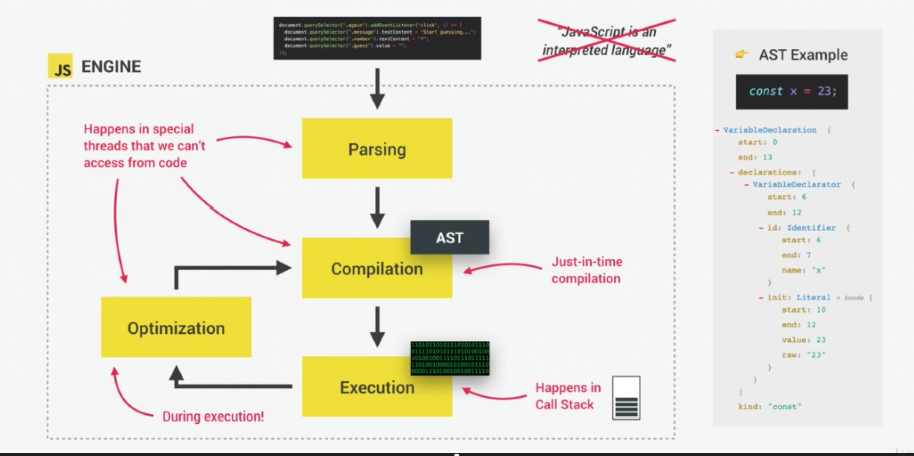
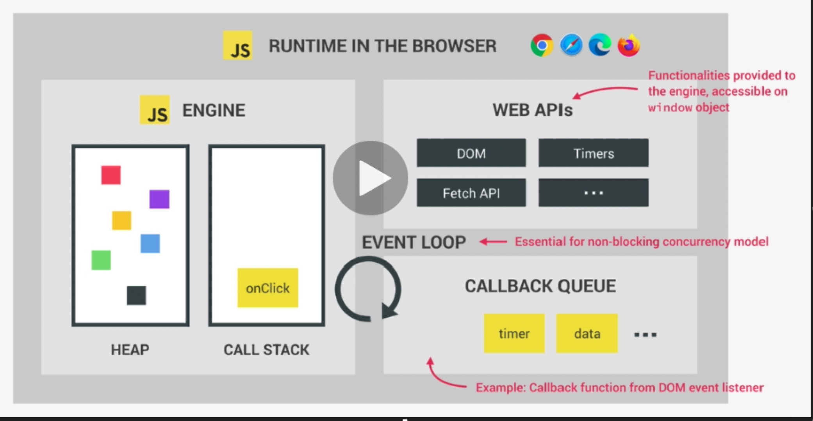
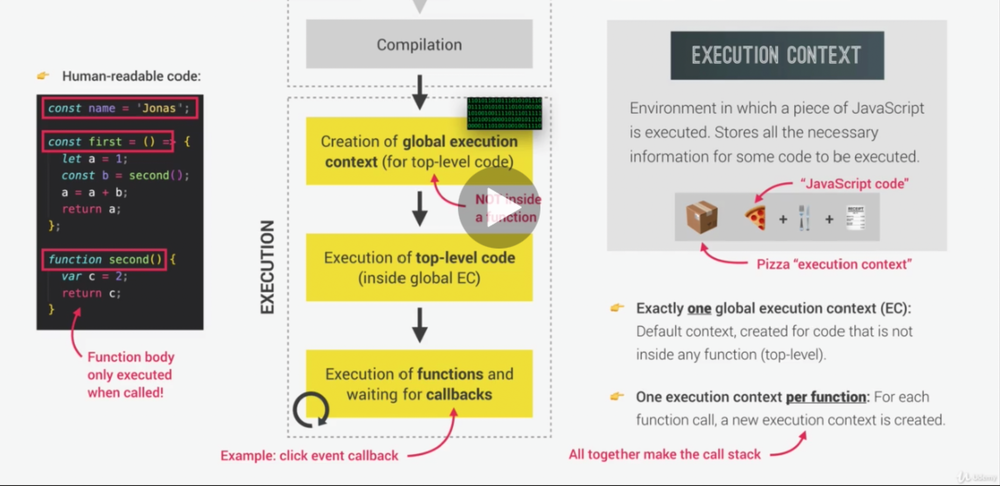
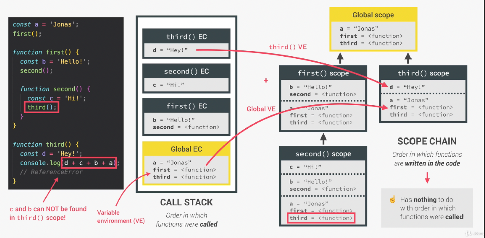
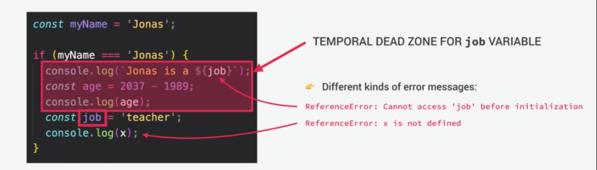
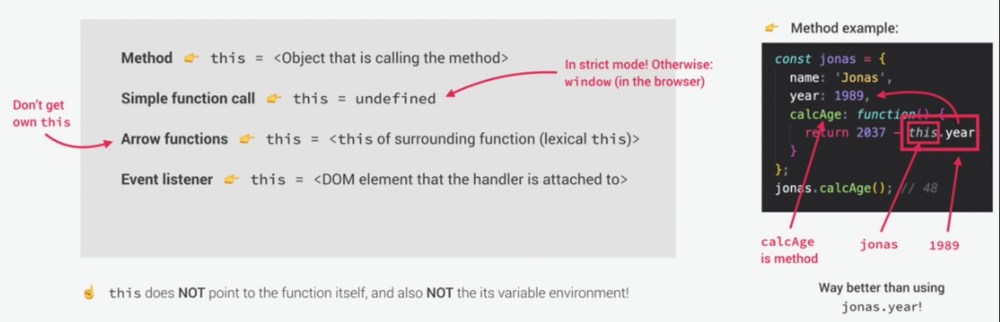
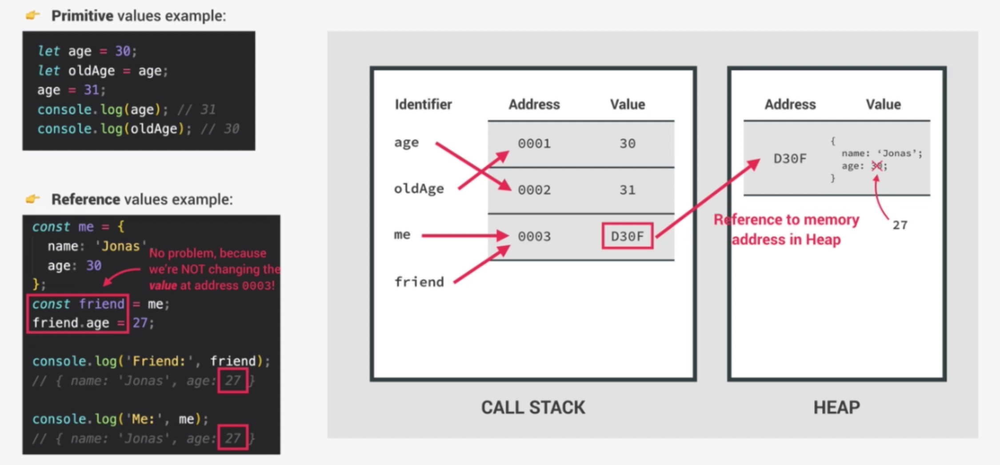

[TOC]

**<u>JavaScript</u>** - A high-level, object-oriented, multi-paradigm, interpreted or just-in-time compiled, dynamic, single-threaded, garbage-collected programming language with first-class functions and a non-blocking event loop concurrency model.

- High-Level – Automatically manages resources
  - Object-Oriented
  - Multi-Paradigm
    - Paradigm: An approach and mindset of structuring code, which will direct your coding style and technique
      - Procedural programming
      - Object-oriented programming
      - Functional programming
  - Interpreted or Just-In-Time Compiled – Compiling occurs within the JS engine
  - Dynamic - Dynamically-typed language. No data type definitions. Types becomes known at runtime. Data type of variable is automatically changed.
  - Single-Threaded - JS runs in one single thread, so it can only do one thing at a time. We want non-blocking behavior.
  - Garbage-Collected – Cleaning the memory so that we don't have to
  - First-Class Functions – Functions are simply treated as variables. We can pass them into other functions, and return them from functions. Passing a function into another function as an argument.
  - Event Loop Concurrency Model - How the JS engine handles multiple tasks happening at the same time. Takes long running tasks, executes them in the "background", and puts them back in the main thread once they are finished.

# Engine

Program that executes JavaScript code.

- Call Stack - Where our code is executed; Execution context
- Heap - Where objects are stored; Object in memory

## Compilation Vs. Interpretation

**Compilation**: Entire code is converted into machine code at once, and written to a binary file that can be executed by a computer.

Source code -> Step 1 Compilation -> Portable file: machine code -> Step 2 Execution -> Program running

**Interpretation**: Interpreter runs through the source code and executes it line by line.

Source code -> Step 1 Execution line by line -> Program running
Code still needs to be converted to machine code

Just-in-time (JIT) compilation: Entire code is converted into machine code at once, then executed immediately.

Same process as compilation except there is no portable file.

Web APIs - Functionalities provided to the engine, accessible on window object; part of runtime (DOM, timers, fetch API, etc).

Execution Context - Environment in which a piece of JavaScript is executed. Stores all the necessary information for some code to be executed.

Compilation begins with creation of global execution context (for top-level code). This is code not inside functions, as those are done at the time they are called. Basically the global variables and declarations.

Exactly one global execution context (EC): Default context, created for code that is not inside any function (top-level).

One execution context per function: For each function call, a new execution context is created.

Call Stack: "Place" where execution contexts get stacked on top of each other, to keep track of where we are in the execution.

# Scope and the Scope Chain

Scoping: How our program's variables are organized and accessed. "Where do variables live?" Or "Where can we access a certain variable, and where not?"

Lexical scoping: Scoping is controlled by placement of functions and blocks in the code

Scope: Space or environment in which a certain variable is declared (variable environment in case of functions). There is global scope, function scope, and block scope

Scope of a variable: Region of our code where a certain variable can be accessed 

Global Scope
	• Outside of any function or block
	• Variables declared in global scope are accessible everywhere

Function Scope
	• Variables are accessible only inside function, NOT outside
	• Also called local scope

Block Scope (ES6)
	• Variables are accessible only inside block (block scoped)
	• HOWEVER, this only applies to let and const variables!
	• Functions are also block scoped (only in strict mode)

Scope Chain

Scope has access to variables from all outer scopes. Scopes go up, not down.
	• Let and const are block-scoped
	• Var is function-scoped

Scope Chain vs. Call Stack

# Variables and Hoisting

Hoisting: Makes some types of variables accessible/usable in the code before they are actually declared. "Variables lifted to the top of their scope".

Behind the scenes...

Before execution, code is scanned for variable declarations, and for each variable, a. new property is created in the  variable environment object.

|                                 | HOISTED                                    | INITIAL VALUE                             | SCOPE                                       |
| ------------------------------- | ------------------------------------------ | ----------------------------------------- | ------------------------------------------- |
| function declarations           | Yes                                        | Actual function                           | Block (in strict mode, otherwise: function) |
| var variables                   | Yes                                        | undefined                                 | Function                                    |
| let and const variables         | No (Techniclally yes, but not in practice) | <uninitialized>, TDZ (Temporal Dead Zone) | Block                                       |
| function expressions and arrows |                                            | Depends if using var or let/const         |                                             |

Why TDZ?

- Makes it easier to avoid and catch errors: accessing variables before declaration is bad practice and should be avoided.
- Makes const variables actually work	

Why Hoisting?

- Using functions before actual declaration
- var hoisting is just a byproduct

# How the This Keyword Works

This keyword/variable: Special variable that is created for every execution context (every function). Takes the value of (points to) the "owner" of the function in which the this keyword is used.

this is NOT static. It depends on how the function is called, and its value is only assigned when the function is actually called.

# Primitives, Objects, and the JS Engine

| Primitives (Primitive Types) stored in call stack:           | Objects (Reference Types) stored in heap:                   |
| ------------------------------------------------------------ | ----------------------------------------------------------- |
| Number String Boolean Undefined Null Symbol BigInt | Object literal Arrays Functions Many more... |

