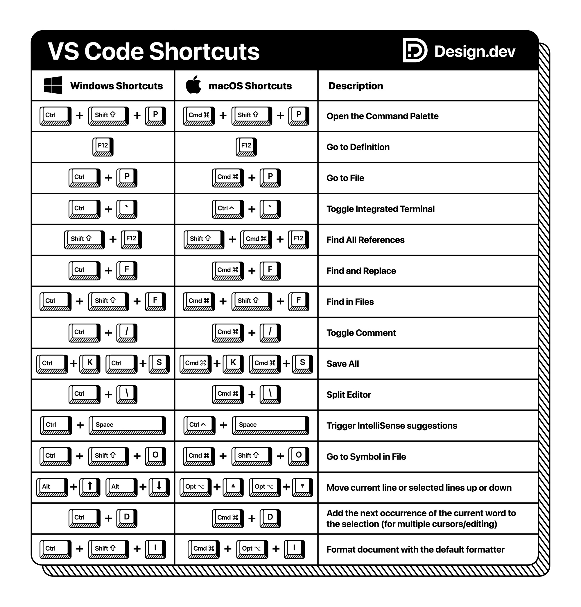

# Programming Notes

## Languages

### [HTML](HTML/README.md)

[HTML](https://developer.mozilla.org/en-US/docs/Web/HTML) is short for HyperText Markup Language and is the foundation of all web pages.

### [CSS](CSS/README.md)

[CSS](https://developer.mozilla.org/en-US/docs/Web/CSS) or **Cascading Style Sheets** is a stylesheet language used to describe the presentation of a document written in HTML or XML. CSS describes how elements should be rendered on screen, on paper, in speech, or on other media.

###  [JavaScript](JavaScript/README.md) 

[JavaScript](www.javascript.com), often abbreviated JS, is a programming language that is one of the core technologies of the World Wide Web, alongside HTML and CSS. 

### [TypeScript](TypeScript/README.md)

[TypeScript]([https://www.typescriptlang.org/) adds additional syntax to JavaScript to support a tighter integration with your editor. Catch errors early in your editor.

### [Java](Java/README.md)

[Java](https://www.java.com/en/) is a high-level, class-based, object-oriented programming language that is designed to have as few implementation dependencies as possible.

## Frameworks/Libraries

###  [Angular](Angular/README.md) 

[Angular](https://angular.io/) is an application design framework and development platform for creating efficient and sophisticated single-page apps. The current, stable version is 14 however the documentation works for 12 and above.

### [React](React/README.md)

[React](https://react.dev) is a JavaScript library for building user interfaces. 

###  [Spring](Spring/README.md) 

The [Spring](https://spring.io/) Framework is an application framework and inversion of control container for the Java platform.

## VS Code Shortcuts

